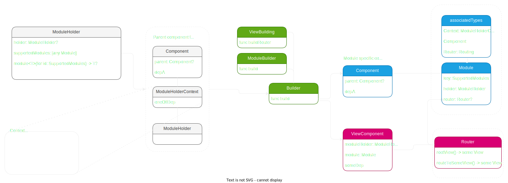

Background
==========

While I was developing a personal Swift application I was having trouble picking a mobile architecture. I've worked with many different architectures in the past, but I wanted to try something new, since this was a personal project anyway. Might as well have some fun. So I decided to create my own architecture.

The architecture takes a lot from the RIBs architecture, with the idea of a builder and a router. Where the builder is responsible for creating the module and router with their respective dependencies. However instead of an interactor I am proposing the idea of a Module instead.

The architecture relies heavily on protocol definitions and generics. This allows for the architecture to be as extensible as possible. Instead of directly referencing a specific type, a protocol definition is used instead.

This will all be open-sourced once I clean up the code a bit more. I will also be creating a sample application.

Quick start
==========

Install the xcode templates using `./scripts/onboard.sh`

Then create a new `Module` by doing `Add new file` -> `Huddle` in Xcode.

Components
==========

The whole architecture leans on the idea of a single source of truth for data flow. Components with dependencies are created and passed along to their respective builders while mainting a parent component connection. These components are used to create Modules.

Its worth to mention ViewComponents here as well. They are only responsible for passing the Router its required dependencies. They do not maintain a dependency graph.

```
public protocol SomeComponent: Component {     
    var depA: DepA { get }   
}    

public class SomeComponentImpl: Component, RootComponent {    
    public var depA: DepA { DepA() }   
}
```  

Dependency lookup is done by traversing the component tree. This is done by using the parentComponent property and using breadth first search. Because dependencies are looked up at runtime using dynamicMemberLookup, this code is necessarily compile time enforced. This means that if a dependency variable name doesn't match directly or the dependency isn't in the tree it will crash at runtime. Dependencies are cached at their respective components to avoid unnecessary lookups.

```
public protocol ComponentProviding: AnyObject, ModuleComponent {
  var parent: Component? { get }
  subscript<T>(dynamicMember member: String) -> T { get }
}

@dynamicMemberLookup
public class Component: ComponentProviding {
  public let parent: Component?

  private var sharedDependencies: [String: Any] = [:]
  private var cachedProperties: [String: Any] = [:]
  
  public init(parent: Component) {
    self.parent = parent
  }

  public init(parent: Component?) {
    self.parent = parent
  }

  public subscript<T>(dynamicMember member: String) -> T {
    if let cached = cachedProperties[member], let val = cached as? T {
      return val
    }
    
    var component: Component? = self
    
    var tree: String = ""
    
    while let comp = component {
      tree += "\(tree.isEmpty ? "" : " -> ")\(String(describing: comp))"
      
      let mirror = Mirror(reflecting: comp)
      
      for c in mirror.children {
        if c.label == member, let value = c.value as? T {
          cachedProperties[member] = value
          return value
        }
      }
      
      component = component?.parent
    }

    fatalError("Cannot find \(member): \(String(describing: T.self)) in component graph: \(tree) ")
  }
  
  public func shared<T>(_ block: () -> T) -> T {
    if let oldDep = sharedDependencies[String(describing: T.self)] {
      return oldDep as? T ?? block()
    }
    
    let dep = block()
    sharedDependencies[String(describing: T.self)] = dep
    return dep
  }
}
```
        
        

Builder
=======

The builder is responsible for creating the Module and Router. It is passed the parent Component, the ModuleHolder, as well as the ModuleHolderContext. It will use those to contruct the module, router, and component dependency graph.

```
public protocol SomeModuleBuilding: ViewBuilding, ModuleBuilder {}

public struct SomeModuleBuilder: SomeModuleBuilding {
  public static func buildRouter<T, R>(component: T) -> R? where T : ViewComponent, R : Routing {
    guard let c = component as? SomeViewComponentImpl else { return nil }
    return SomeModuleRouter(component: c) as? R
  }
  
  public static func build(parentComponent: Component, holder: ModuleHolding?, context: RootModuleHolderContext) -> StoreModule {
      let component = SomeModuleComponentImpl(parent: parentComponent)
      let module = SomeModule(holder: holder, context: context, component: component)

      let viewComponent = SomeModuleComponentImpl(module: module, moduleHolder: holder)
    
      module.router = buildRouter(component: viewComponent)
      
      return module
  }
}
```

Creating a `Component` here should take in the `parent` that has the dependencies in the graph. 

Example:

```
public final class LoginMaintenanceStepComponentImpl: Component, LoginMaintenanceStepComponent {
  public let databaseProvider: MutableDatabaseProviding
  public let userStorageProvider: UserStorageProviding
  public let mutableUserStream: MutableUserStreaming
  public let userFetchProvider: UserFetchProviding
  public let keychainProvider: KeychainProviding
  
  public override init(parent: Component) {
    self.databaseProvider = parent.databaseProvider
    self.userStorageProvider = parent.userStorageProvider
    self.mutableUserStream = parent.mutableUserStream
    self.userFetchProvider = parent.userFetchProvider
    self.keychainProvider = parent.keychainProvider
    
    super.init(parent: parent)
  }
}
```
Here we are overriding the `required parent` initializer and setting our dependencies within the component itself. There is an `optional parent` initializer as well. This should be reserved for creating `root` level components that don't have any parent dependencies. 

Or you can use the built in macro for building a component
```
import HuddleMacros

@ComponentImpl
public final class LoginMaintenanceStepComponentImpl: Component, LoginMaintenanceStepComponent {
  public let databaseProvider: MutableDatabaseProviding
  public let userStorageProvider: UserStorageProviding
  public let mutableUserStream: MutableUserStreaming
  public let userFetchProvider: UserFetchProviding
  public let keychainProvider: KeychainProviding
}
```

Module
======

Module base class that should be overriden: 

```
open class ModuleObject<Context: ModuleHoldingContext, Component, Router: Routing>: NSObject, Module {
  open weak var holder: ModuleHolding?
  
  open var router: Router?
  
  public required init(holder: ModuleHolding?, context: Context, component: Component) {
    self.holder = holder
  }
  
  open func onActive() {
    // no op. Override to perform action when Holder is ready
  }
}
```

Modules contain code specific to their feature use case. This makes them highly testable since you only need to inject the required dependencies to build them as they are standalone. The only visible functions when this module is referenced are the ones in defined in its supporting protocol.

```
public protocol SomeModuleComponent: Component {  
    var depA: DepA { get }  
}    

public class SomeModuleComponentImpl: Component, SomeModuleComponent {
    public var depA: DepA          
    public override init(parent: Component?) {       
        self.depA = parent.depA       
        super.init(parent: parent)     
    }   
}    

public protocol SomeModuleSupporting {     
    // public facing functions for the module   
}   


public final class SomeModule: ModuleObject<ParentModuleContext, SomeModuleComponentImpl, SomeRouter>, SomeModuleSupporting {   
    public weak var holder: ModuleHolder?    
    public var router: SomeRouter?    
    private let depA: DepA    

    public init(holder: ModuleHolder?, context: SomeModuleHolderContext, component: SomeModuleComponent) { 
        self.holder = holder       
        depA = component.depA     
    }         

    // public facing functions for the module  
}
```

Router
======

What you'll see as you read this is that the Router example uses SwiftUI. This is not necessarily a requirement but just what I've been using in my personal app. There will be a UIKit version available as well.

The Router is responsible for providing a UI for the Module. It contains routes for the UI to navigate to if there are actions taken by the user in the UI. A module is not required to have a router if there is no user facing actions required.

Routers need to be marked `@MainActor` and should inherit from the `Router` class.

```
public protocol SomeViewComponent: ViewComponent {
  var module: SomeModuleSupporting { get }
  var moduleHolder: ModuleHolder? { get }
}

public struct SomeViewComponentImpl: SettingsViewComponent {
  public var module: SettingsSupporting
  public var moduleHolder: ModuleHolder?
}

@MainActor
public protocol SomeModuleRouting: Router {}

@MainActor
public class SomeModuleRouter: Router, SomeModuleRouting, Logger {
  public var logLevel: LogLevel = .high
  private let moduleHolder: RootModuleHolder?
  private let component: StoreViewComponent
  
  public init(component: StoreViewComponent) {
    self.component = component
    self.moduleHolder = component.moduleHolder as? SomeModuleHolder
    super.init()
    if moduleHolder == nil {
      log(type: .message, message: "No valid ModuleHolder to be found in \(#file)")
    }
  }
  
  public override func rootView() -> any View {
    SomeRootView()
  }
}
```  

ModuleHolder
============

The introduction of the ModuleHolder is what I think makes this architecture unique. The ModuleHolder is a class that is a Module itself but also can contain other Modules. This allows for a module and router tree to be created allowing for any module or router to call any other module or router up the tree without having it injected as a dependency. This maintains the testability of the modules and routers. Just specify the class of module you want from the tree and it will search through the branches and find the closest one. If there are more than one of that type it will take the one closest to the caller in the tree.

```
open class ModuleHolder: ModuleHolding {
  public var holder: ModuleHolding? = nil
  public var supportedModules: [any Module] = []
  
  public init(holder: ModuleHolding? = nil) {
    self.holder = holder
  }

  public func module<M>() -> M? {
    let t: M? = self.getModule()
    return t
  }
  
  public func router<R, M>(for type: M.Type) -> R? {
    let t: M? = self.getModule()
    let r = t as? (any Module)
    return r?.router as? R
  }
  
  private func getModule<M>() -> M? {
    var holder: ModuleHolding? = self
    while holder != nil {
      
      if let m: M = holder?.supportedModules.first(where: { $0 is M }) as? M {
        return m
      }
      
      holder = self.holder
    }
    
    return nil
  }
}
```
      
      

Module and router lookup is done using breadth first search on the module tree.

```
open class ModuleHolder: ModuleHolding {
  public var holder: ModuleHolding? = nil
  public var supportedModules: [any Module] = []
  
  public init(holder: ModuleHolding? = nil) {
    self.holder = holder
  }
  
  public subscript<T, M: Module>(dynamicMember member: M.Type) -> T? where T : Module {
    var holder: ModuleHolding? = self
    while holder != nil {
      
      if let m: T = holder?.supportedModules.first(where: { $0 is M }) as? T {
        return m
      }
      
      holder = self.holder
    }
    
    return nil
  }

  public func module<M: Module>(for id: M.Type) -> M? {
    let t: M? = self[dynamicMember: id]
    return t
  }
  
  public func router<M: Module>(for id: M.Type) -> M.Router? {
    let t: M? = self[dynamicMember: id]
    return t?.router as? M.Router
  }
}

```

Flow Module
==========

Flow modules are not necessarily `Modules` themselves but they can be. They provide a way to perfrom tasks in series. For example, if you needed a `login step` -> `clean up step` -> `backup step` where each step needs to be performed in series. 

```
@ComponentImpl
public class SomeFlowModuleComponentImpl: Component, SomeFlowModuleComponent {
  // implement dependencies here
  public let depA: DepA
  public let depB: DepB
  public let depC: DepC
  
  public var firstStepComponent: FirstStepComponent {
    FirstStepComponentImpl(parent: self)
  }

  public var secondStepComponent: SecondStepComponent {
    SecondStepComponentImpl(parent: self)
  }
  
  public var ThirdStepComponent: ThirdStepComponent {
    ThirdStepComponent(parent: self)
  }
}

public protocol SomeFlowModuleSupporting {
  func run()
}

public struct SomeFlowContext {}

public final class SomeFlowModule: FlowModule<SomeFlowContext>,
                                      SomeFlowModuleSupporting,
                                      Module {
  
  public weak var holder: ModuleHolding?
  public weak var router: SomeFlowRouter?
    
  deinit {
    // remove steps as this can cause a memory leak
    steps = []
  }
  
  public func onActive() {
    // no op
  }
  
  public func onAppear() {
    // no op
  }
  
  public init(holder: ModuleHolding?, context: SomeRootModuleHolderContext, component: SomeFlowModuleComponent) {
    self.holder = holder
    
    let context = SomeFlowContext()
    
    super.init(context: context)
    
    self.steps = [
      FirstStep(flowModule: self, context: context, component: component.firstStepComponent),
      SecondStep(flowModule: self, context: context, component: component.secondStepComponent),
      ThirdStep(flowModule: self, context: context, component: component.thirdStepComponent)
    ]
  }
}
```

Here we create some `FlowModule` with some `steps` that has one function `run()`. When calling `run()` it will call the parent `FlowModule` run function. This will run through the `Flows` automatically. **It is required that your step calls `onNext` when it is completed.**

```
public final class FirstStep: Flow<SomeFlowContext> {
  private let depA: 
  
  public init(flowModule: FlowModule<SomeFlowContext>,
              context: SomeFlowContext,
              component: FirstStepComponent) {
    self.depA = component.depA
    
    super.init(flowModule: flowModule, context: context, component: component)
  }
  
  public override func isApplicable(context: SomeFlowContext) -> Bool {
    true
  }
  
  public override func run() {
    // do some logic
    onNext()
  }
```

This is an example `Flow` step. It takes in the context and the component specific to this step. The `SomeFlowContext` is some non-dependency graph object. Could be used to pass one-off state. 

In the `run` function we perform some action and then call `onNext`. This will tell the `flowModule` that this step is completed and to move on. Before a step is run it checks `isApplicable` with the context. Here you can optionally skip a step based on some state if needed.
    
    

Below I will get into the specifics of how this architecture works and the role of the ModuleHolder.

Basic Flow
==========

The below flow describes the creation of a Module and how its dependencies can be tracked back to the ModuleHolder. Modules are held in a ModuleHolder object. This object contains all modules for that specific level. They can also contain other ModuleHolders. It's a dependency tree effectively. The ModuleHolder builds each Module using its Component and ModuleHolderContext. A Builder is responsible for creating the Module and it associated Router. The Router manages all UI related code. It has its own Component called a ViewComponent, which carries its dependencies. There's no graph associated with the ViewComponent. The Component passed to the Builder and then onto to the Module will be included in the dependency tree. If a Module needs a dependency from a Component, the Component will look up a dependency with the same name and type from itself and then progress upward through its parent and so on. Once the Module specific Component is created in the Builder it will be used to create the Module.

----------------------------------------------------------------------------------------------------------------------------------------------------------------------------------------------------------------------------------------------------------------------------------------------------------------------------------------------------------------------------------------------------------------------------------------------------------------------------------------------------------------------------------------------------------------------------------------------------------------------------------------------------------------------------------------------------------------------------------------------------------------------------------------------------------------------------------------------------------------------------------------------------------------------------------------------------------------------------------------------------------------------------------------------------



Dependency Flow
===============

This flow describes how dependencies are passed between modules. The components build a dependency graph where each module can look up a desired dependency up through the graph.

---------------------------------------------------------------------------------------------------------------------------------------------------------------------------------


What now?
=========

I don't plan on wide-spread adoption of this framework. I just wanted to share my journey and what I've learned throughout the process of developing a personal app. A lot of developers struggle with which architecture to use when writing their apps. I'm here to say that there is no correct way, unless you're working on a team and have to follow a specific architecture, and this post is proof. Just have fun with it and continue to learn throughout the way! Don't stress.


---------------------------------------------------------------------------------------------------------------------------------------------------------------------------------------------------------------------------------------------------------------------------------------------------------------------------------------------------------------------------------------------------------------------------------------------------------------------------------------------
